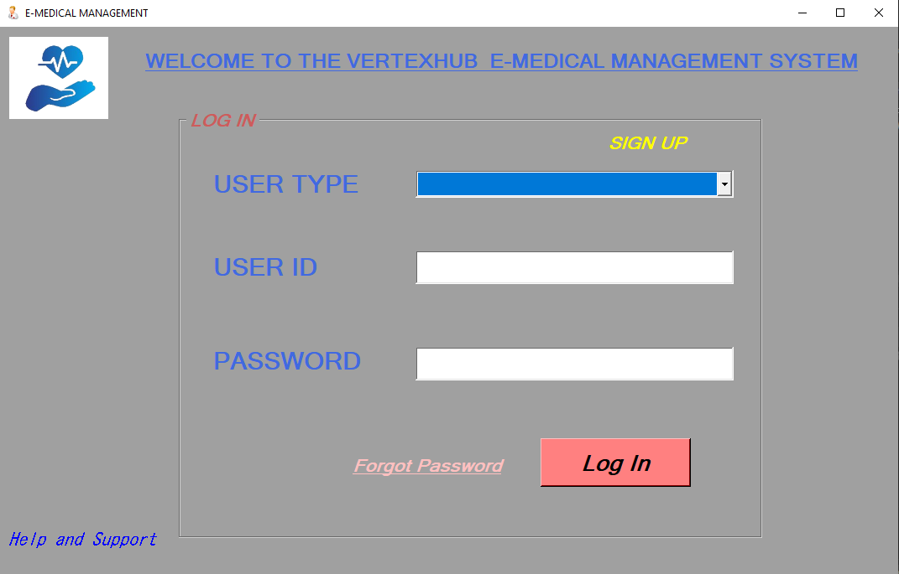
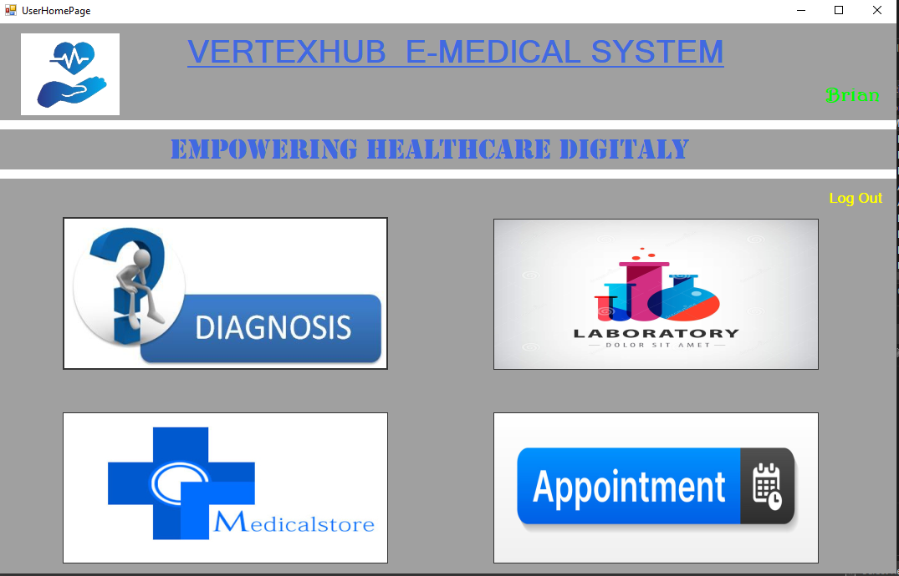
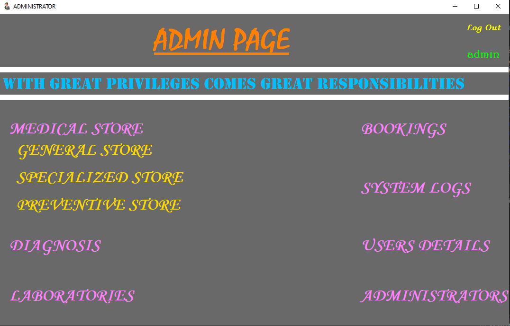

# VERTEXHUB-E-MEDICAL-MANAGEMENT-SYSTEM
 This robust system integrates electronic medical records (EMR), patient scheduling and administrative tasks into a unified platform. VERTEXHUB-E-MEDICAL-MANAGEMENT-SYSTEM aims to enhance operational efficiency, improve patient care, and simplify administrative tasks in medical practices, clinics, and hospitals.

### LAUNCHER

### Preview :

#

## Login

#

## User Home

#

## Admin Home

#

## DB Structure

